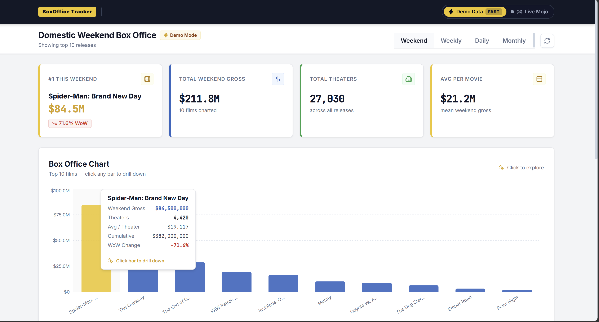
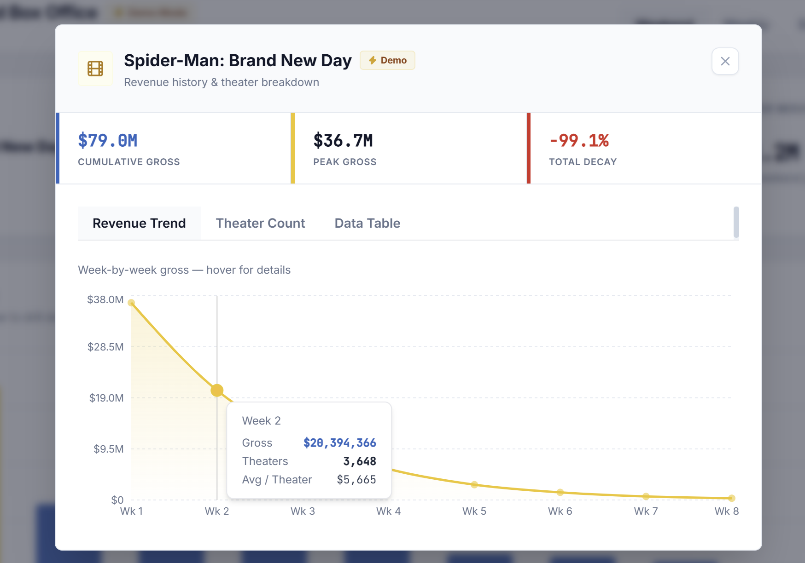

# BoxOffice Tracker — Movie Box Office Dashboard

[](https://react.dev/)
[](https://www.typescriptlang.org/)
[](https://vitejs.dev/)
[](https://fastapi.tiangolo.com/)
[](https://www.python.org/)
[](https://tailwindcss.com/)

A modern, high-performance domestic movie box office analytics platform. Built with an IMDb Pro-inspired cinematic design, interactive Recharts visualizations, multi-timeframe aggregations, and a dual-engine architecture supporting both live Box Office Mojo scraping and instant mock demonstration data.

---

## Preview

### Executive Overview & Rankings Table


### In-Depth Movie Drill-Down & Decay Curves


---

##  Features

- ** Multi-Timeframe Analytics**
  - Switch seamlessly between **Weekend**, **Weekly**, **Daily**, and **Monthly** domestic box office charts.
  - Automatic calculation of timeframe revenue, theater counts, per-screen averages, and release longevity.

- ** Key Performance Indicators (KPIs)**
  - Dynamic KPI cards highlighting **Total Period Gross**, **#1 Leading Title**, **Active Theater Reach**, and **Overall Per-Screen Average**.
  - Shimmer loading skeletons for seamless asynchronous data transitions.

- ** Interactive Movie Drill-Down Modal**
  - Click any movie in the rankings to launch an in-depth analytics drawer.
  - **Revenue Decay Curve**: Interactive SVG Area Chart plotting week-over-week revenue trends.
  - **Theater Distribution**: Bar chart comparing weekly screen counts.
  - **Performance Metrics**: Instant calculations for Cumulative Gross, Peak Week Gross, and Retention / Drop-off %.

- ** Dual-Engine Data Architecture**
  - **Live Scraper Engine**: FastAPI backend wrapping [`boxoffice-api`](https://pypi.org/project/boxoffice-api/) to scrape real-time Box Office Mojo data with background cache warming.
  - **Demo / Standalone Mode**: Built-in mock data generators and client-side failover enabling full offline functionality and zero-latency exploration.

- ** IMDb-Inspired Pro Aesthetics**
  - Sleek dark and light contrasting surfaces, gold accent highlights (`#f5c518`), tabular figures for financial data, and smooth micro-animations.
  - Accessible dialogs and primitives powered by Radix UI.

---

##  Tech Stack

### Frontend
- **Framework**: [React 19](https://react.dev/) + [Vite](https://vitejs.dev/)
- **Language**: [TypeScript](https://www.typescriptlang.org/)
- **Styling**: [Tailwind CSS](https://tailwindcss.com/)
- **Charts & Data Viz**: [Recharts](https://recharts.org/)
- **UI Components**: [Radix UI Dialog, Select, Tabs, Tooltip](https://www.radix-ui.com/)
- **Icons**: [Lucide React](https://lucide.dev/)
- **Linter**: [Oxlint](https://oxc.rs/)

### Backend
- **Framework**: [FastAPI](https://fastapi.tiangolo.com/) (Python 3.10+)
- **Server**: [Uvicorn](https://www.uvicorn.org/)
- **Scraper / Client**: [`boxoffice-api`](https://pypi.org/project/boxoffice-api/) (Box Office Mojo & optional OMDb integration)
- **Environment**: [`python-dotenv`](https://pypi.org/project/python-dotenv/)

---

##  Repository Structure

```text
Movie Dashboard/
├── backend/
│   ├── .env.example          # Template for backend environment variables
│   ├── main.py               # FastAPI application, caching & scraping logic
│   └── requirements.txt      # Python dependencies
├── frontend/
│   ├── src/
│   │   ├── components/       # UI Components (KPIs, Charts, Table, Modals)
│   │   │   ├── DataSourceToggle.tsx
│   │   │   ├── KPICards.tsx
│   │   │   ├── MovieDrillDownModal.tsx
│   │   │   ├── RankingsTable.tsx
│   │   │   ├── TimeframeSelector.tsx
│   │   │   └── WeeklyOverviewChart.tsx
│   │   ├── context/          # Global Dashboard state & demo toggle
│   │   ├── lib/              # API fetchers, data mock fallbacks & formatters
│   │   ├── pages/            # Main Dashboard view
│   │   ├── types/            # TypeScript interfaces for box office models
│   │   ├── App.tsx
│   │   └── main.tsx
│   ├── package.json
│   ├── tailwind.config.js
│   └── vite.config.ts
├── screenshots/              # UI previews for documentation
└── README.md
```

---

## Getting Started

### Prerequisites
- **Node.js** (v18.0 or higher) & **npm**
- **Python** (v3.10 or higher) & **pip**

---

### 1. Backend Setup

1. Open your terminal and navigate to the `backend` folder:
   ```bash
   cd backend
   ```

2. Create and activate a Python virtual environment:
   ```bash
   # On macOS/Linux
   python3 -m venv venv
   source venv/bin/activate

   # On Windows (PowerShell)
   python -m venv venv
   .\venv\Scripts\Activate.ps1
   ```

3. Install the dependencies:
   ```bash
   pip install -r requirements.txt
   ```

4. *(Optional)* Configure your environment variables:
   ```bash
   cp .env.example .env
   ```
   > **Note:** If `OMDB_API_KEY` is not provided in `.env`, the backend will default to high-fidelity mock data mode while still serving all API routes smoothly.

5. Start the FastAPI development server:
   ```bash
   uvicorn main:app --reload --port 8080
   ```
   The backend API is now running at `http://localhost:8080`.
   Interactive Swagger docs are accessible at `http://localhost:8080/docs`.

---

### 2. Frontend Setup

1. Open a new terminal tab and navigate to the `frontend` folder:
   ```bash
   cd frontend
   ```

2. Install dependencies:
   ```bash
   npm install
   ```

3. Start the Vite development server:
   ```bash
   npm run dev
   ```

4. Open your browser and navigate to:
   ```text
   http://localhost:5173
   ```

---

##  API Reference

| Endpoint | Method | Parameters | Description |
| :--- | :--- | :--- | :--- |
| `/api/weekend` | `GET` | `year?: int`, `week?: int`, `demo?: bool` | Retrieves domestic weekend box office rankings |
| `/api/weekly` | `GET` | `year?: int`, `week?: int`, `demo?: bool` | Retrieves domestic weekly box office rankings |
| `/api/daily` | `GET` | `date?: YYYY-MM-DD`, `demo?: bool` | Retrieves single-day box office rankings |
| `/api/monthly` | `GET` | `year?: int`, `month?: int`, `demo?: bool` | Retrieves monthly box office performance |
| `/api/movie/history`| `GET` | `title: str`, `demo?: bool` | Fetches historical weekly gross & theater counts for a movie |
| `/api/health` | `GET` | *none* | Health check & background cache status |

---

##  Configuration & Modes

- **Live Mode**: Set `OMDB_API_KEY` in `backend/.env`. The backend warms its cache asynchronously on startup and serves live data scraped from Box Office Mojo.
- **Demo Mode**: Can be toggled on-the-fly directly in the top-right corner of the dashboard interface. This enables instant querying without hitting network or scraping bottlenecks.

---

##  Available Scripts

### Frontend (`/frontend`)
- `npm run dev`: Starts the local Vite development server with HMR.
- `npm run build`: Type-checks and creates an optimized production bundle in `dist/`.
- `npm run lint`: Fast code linting using [Oxlint](https://oxc.rs/).
- `npm run preview`: Previews the production build locally.

---

##  License

This project is licensed under the [MIT License](LICENSE).
